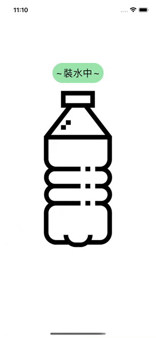

# WWProgressView
[](https://developer.apple.com/swift/) [](https://developer.apple.com/swift/) [](https://developer.apple.com/swift/) [](https://developer.apple.com/swift/)

### [Introduction - 簡介](https://swiftpackageindex.com/William-Weng)
- A dynamically flowing progress bar.
- 一個動態流動的進度條.



### [Installation with Swift Package Manager](https://medium.com/彼得潘的-swift-ios-app-開發問題解答集/使用-spm-安裝第三方套件-xcode-11-新功能-2c4ffcf85b4b)
```
dependencies: [
    .package(url: "https://github.com/William-Weng/WWProgressView.git", .upToNextMajor(from: "1.0.3"))
]
```


### Function - 可用函式
|函式|功能|
|-|-|
|updateHeight(_:radius:startAngle:count:)|更新百分比|

### Example
```swift
import UIKit
import WWProgressView

final class ViewController: UIViewController {

    @IBOutlet weak var myProgressView: WWProgressView!
    
    private var percentage: Double = 0
    private var timer: CADisplayLink?
    private var startAngle: Int = 0
    
    override func viewDidLoad() { super.viewDidLoad() }
    
    @IBAction func running(_ sender: UIButton) { update() }
    
    /// 使用定時器更新 (CADisplayLink)
    func update() {
        
        percentage = 100
        
        timer?.invalidate()
        timer = nil
        
        timer = CADisplayLink(target: self, selector: #selector(updatePercentage))
        timer?.preferredFramesPerSecond = 60
        timer?._fire()
    }
    
    /// 更新進度條 (高度)
    /// - Parameter sender: CADisplayLink
    @objc private func updatePercentage(_ sender: CADisplayLink) {
        
        let height = myProgressView.frame.height * percentage / 100
        
        myProgressView.updateHeight(height, radius: 4.0, startAngle: startAngle % 360, count: 5.0)
        startAngle += 5
        percentage -= 0.5
    }
}
```
